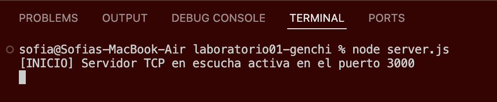
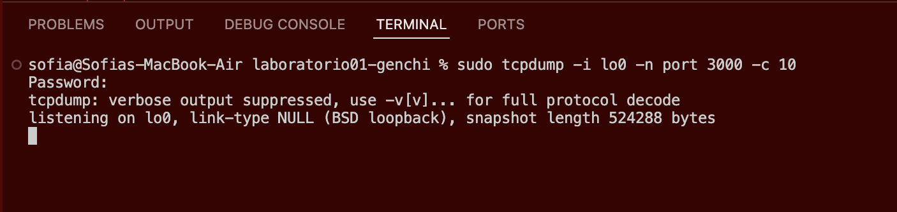
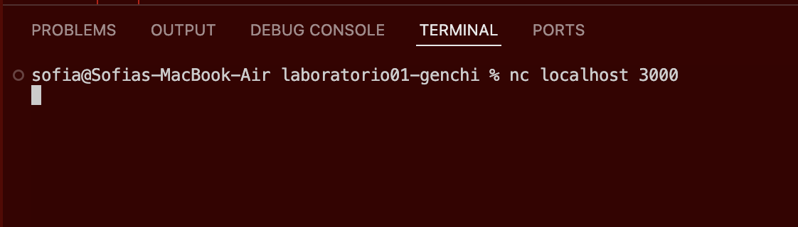
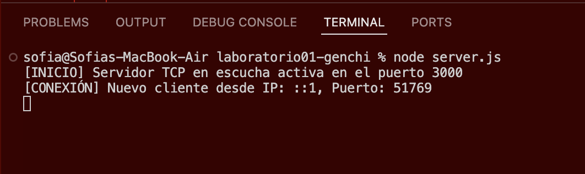
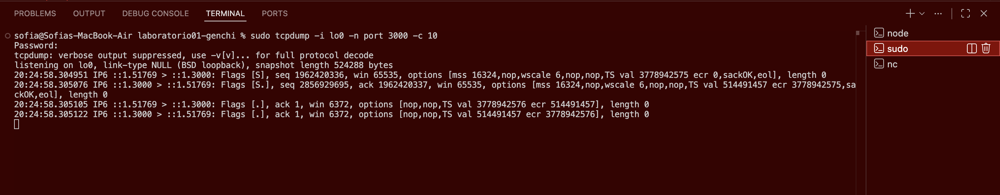
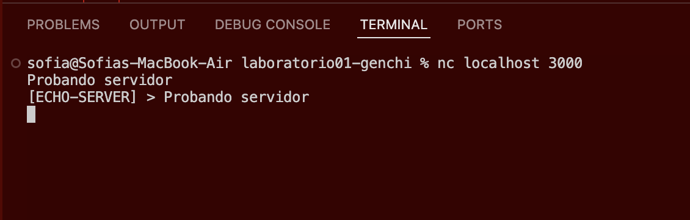
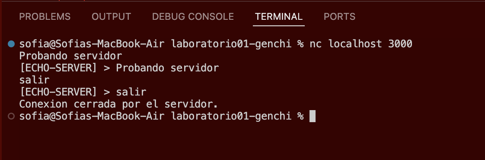
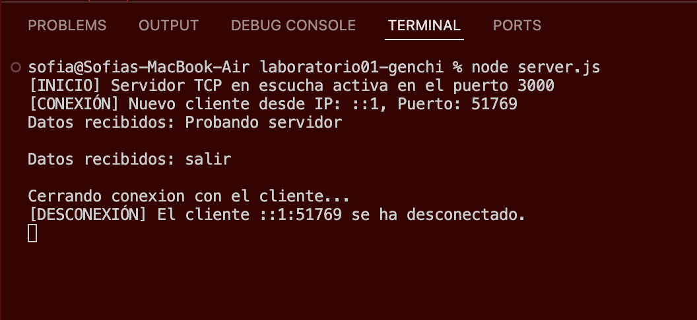

# Ejecución y Capturas

### Paso 1: Arrancar el Servidor (Terminal 1)
* Se ejecuta el comando `node server.js`.

### Paso 2: Ejecutá el comando de inspección (Terminal 2)
* Se ejecuta el comando `sudo tcpdump -i lo0 -n port 3000 -c 10`.

### Paso 3: Establecer la conexion (Terminal 3)
* Se ejecuta el comando del cliente: `nc localhost 3000`.

### Paso 4: Conexion del nuevo cliente
* Se ve el log que informa la conexion del nuevo cliente con su IP y puerto remoto.

### Paso 5: Three-Way Handshake
* Captura de pantalla donde se señala las tres banderas del Three-Way Handshake: '[S] (SYN), [S.] (SYN-ACK) y [.] (ACK)'.

### Paso 6: Prueba de conexion
* Mensaje de prueba `Probando servidor` en la terminal 3.
* Utilizar netcat o telnet para enviar mensajes y verificar la respuesta del servidor. Se debe ver tu mensaje enviado y la respuesta inmediata del servidor con el prefijo obligatorio [ECHO-SERVER] > .

### Paso 7: Prueba de cierre de conexion (Terminal 3 y 1)
* En la terminal 3 se envia 'salir'.
* En la terminal 1 se muestra el log que detecta y anuncia que el cliente se ha desconectado.

